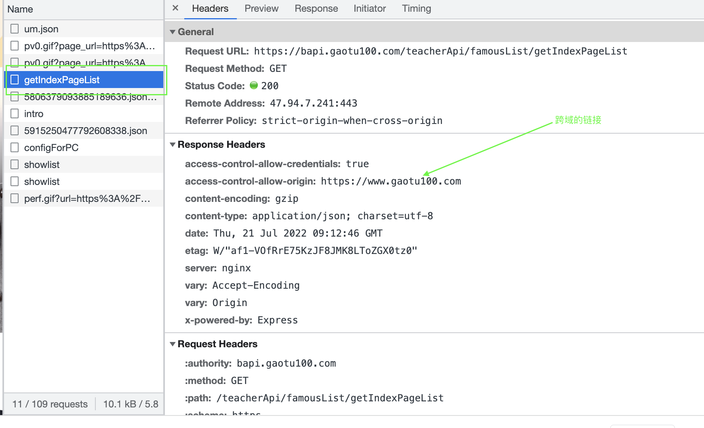
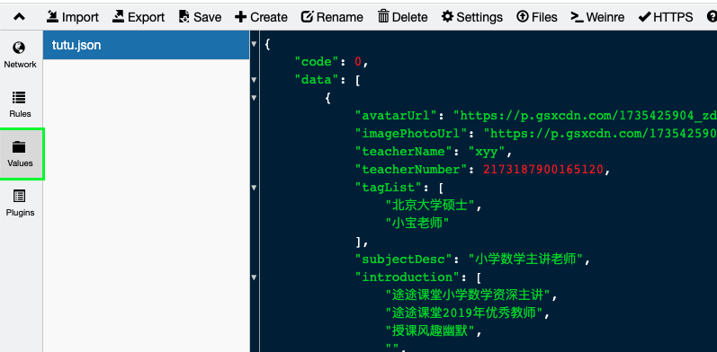
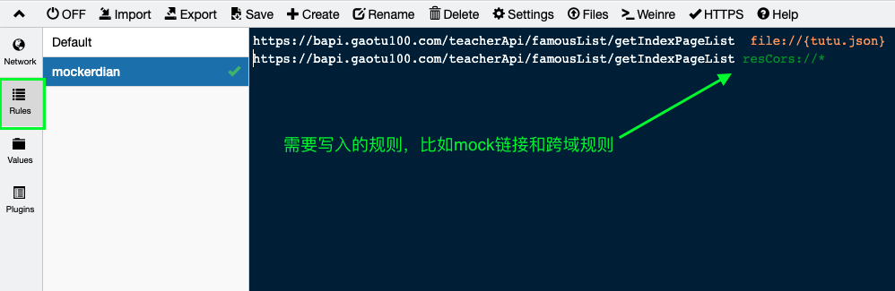

## whistle使用手册

#### 什么是whistle

whistle的汉译是“哨子”的意思，可能从简单的汉译我们并不能理解这个工具到底有什么含义。而它的gitBook里的含义则是基于Node实现的跨平台web调试工具，主要是用于查看、修改HTTP、HTTPS、Websocket请求、响应、也可以作为HTTP代理服务器使用。

#### whistle 和 charles区别

个人愚见除了付费之外没有什么区别，whistle是纯代码自己配置，charles更白甜一点。

#### 上手whistle

详细参见：https://github.com/avwo/whistle

注意事项：

1. 安装whistle的时候记得要在root权限 -- sudo -s

2. chrome浏览器+手机端配置代理：

   1. chrome需要安装SwitchyOmega插件，直接chrome商店搜索安装即可；配置参数如下：

      

   2.  ITtem启动whistle -- w2 start

   3. 点击HTTPS按钮出现二维码：Enable HTTP/2选项要选上（选不上有可能是node版本太低，建议更新node版本）

      点击Download RootCA 下载CA证书，钥匙串要去进行CA证书认证

      

   4. IOS手机微信扫码下载证书，证书保存到文件，在文件里点击安装；然后设置 => 通用 => 关于本机 => 证书信任设置

   5. 安卓手机不需要证书信任，直接下载安装就行。

3. 跨域问题：

   1. 找到自己想要代理mock数据的接口

      

      2. 在http://127.0.0.1:8899/#values网址里点击create按钮新建一个values；里面放置接口Reaponse的内容，可自行修改

         

   3. 在http://127.0.0.1:8899/#rules 配置代理规则和跨域规则

      file:// {values文件名}

      re sCors:// * 配置跨域

​			